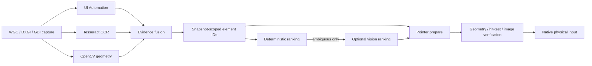

# Computer Use Win OpenCV MCP

<p align="center">
  A local-first Windows computer-use MCP server that grounds actions with<br />
  <strong>UI Automation + OCR + OpenCV + optional vision-model ranking</strong>.
</p>

<p align="center">
  
  
  
  
</p>

This server is designed to reduce wrong-position clicks. It does not ask an AI agent to guess raw screen coordinates whenever Windows or local vision can identify a target first. Every observation creates short-lived element IDs, bounds, confidence, evidence sources, and safe interior points. Pointer activation then uses a two-step prepare/commit protocol that rechecks cursor position, fresh window geometry, exact top-level hit target, UI Automation identity, and a target-local visual signature inside one serialized input transaction before sending native input.

It is a standalone repository. It does not import packages, configuration, source files, or build tooling from a parent monorepo.

## What the hybrid system does

| Layer | Best at | Output |
| --- | --- | --- |
| Windows UI Automation | Native controls, roles, names, values, actions, clickable points | Semantic elements with high-confidence action targets |
| Tesseract OCR | Text painted into apps, canvases, remote desktops, and images | Text lines and words with bounding boxes |
| OpenCV | Borders, icons, regions, handles, bars, contours, and safe interior geometry | Visual candidates that do not depend on accessibility support |
| Optional vision model | Ambiguous icons, canvas content, 3D objects, and game scenes | A ranking of existing element IDs, never unrestricted coordinates |
| Native Windows input | Physical mouse paths, relative camera movement, scan codes, held input, and timed sequences | Verified `SendInput` actions with cursor readback |

The calling agent normally receives a compact, priority/source/spatially diverse list of useful elements and resource URIs. Standard observations keep image data out of the response by default. Deep observations include a Set-of-Mark image by default so a vision-capable caller can reason over difficult scenes without a second tool call; callers can set `inlineImage: false` when they only need structured local detections.



## Requirements

- Windows 10 or Windows 11 with an unlocked interactive desktop session.
- Node.js 24 or newer.
- Windows PowerShell 5.1 or newer.
- A desktop user allowed to capture and control the target applications.

The server does not require a separately installed OpenCV build, Python runtime, .NET SDK, or files from another repository. OpenCV runs through the packaged WebAssembly build; native Windows capture and input dependencies are installed by npm.

## Install

```powershell
git clone git@github.com:mlnima/computer-use-win-opencv-mcp.git
Set-Location computer-use-win-opencv-mcp
Copy-Item .env.example .env
npm ci
npm run build
```

The server resolves `.env` beside `package.json`, so an MCP host can launch the absolute `dist\index.js` path from any working directory. Relative runtime and OCR language paths are also resolved from the repository root.

The example token is intentionally `change.me` for first testing and binds only to loopback. Non-loopback HTTP refuses to start with that placeholder or a token shorter than 24 characters unless the explicit test-only override is enabled and at least one client IP is allowlisted.

## Run with stdio

```powershell
npm start
```

Equivalent direct command:

```powershell
node .\dist\index.js --transport stdio
```

A generic stdio MCP client entry looks like this:

```json
{
  "mcpServers": {
    "computer-use-win-opencv": {
      "command": "node",
      "args": ["C:\\absolute\\path\\computer-use-win-opencv-mcp\\dist\\index.js", "--transport", "stdio"],
      "env": {
        "COMPUTER_USE_AUTH_TOKEN": "change.me"
      }
    }
  }
}
```

Stdio writes only MCP protocol messages to stdout. Diagnostics are written to stderr.

## Run with Streamable HTTP

The `.env.example` file binds HTTP to loopback on port `7331`:

```powershell
npm run start:http
```

The MCP endpoint is:

```text
http://127.0.0.1:7331/mcp
```

Clients must send:

```text
Authorization: Bearer change.me
```

A common `mcpServers` JSON configuration for a Streamable HTTP client is:

```json
{
  "mcpServers": {
    "computer-use-win-opencv": {
      "type": "streamable-http",
      "url": "http://127.0.0.1:7331/mcp",
      "headers": {
        "Authorization": "Bearer change.me"
      }
    }
  }
}
```

For LAN use, replace `127.0.0.1` with the Windows computer's IP address and replace `change.me` with the same strong token configured on the server. Client configuration field names can vary; clients that label this transport `http` should use that label while keeping the same MCP URL and authorization header. For isolated short-lived testing with an already configured `change.me` client, set `COMPUTER_USE_ALLOW_EXAMPLE_TOKEN_ON_LAN=true` and `COMPUTER_USE_ALLOWED_CLIENT_IPS=<client-ip>` on the server. Both controls are required for weak-token LAN startup; other non-loopback source addresses receive `403` before authentication.

The authenticated health endpoint is `GET /health`. The server implements MCP Streamable HTTP session initialization, POST requests, SSE streaming through GET, session deletion, bounded concurrent initialization, and idle-session cleanup. Each network session receives its own MCP transport while all sessions coordinate through one hardware-input queue and one mandatory exclusive lease for desktop mutations.

For another computer on the local network, set `COMPUTER_USE_HOST=0.0.0.0`, replace `change.me` with a random token of at least 24 characters, start the server, and connect to `http://<windows-computer-ip>:7331/mcp`. Prefer a trusted LAN, VPN, or TLS reverse proxy because bearer tokens and MCP traffic are otherwise plaintext.

To run stdio and HTTP in the same process:

```powershell
node .\dist\index.js --transport all
```

Command-line `--host` and `--port` override their environment values. Keep credentials in the environment rather than command-line arguments so they are not exposed in the process list.

## Configuration

| Variable | Example | Purpose |
| --- | --- | --- |
| `COMPUTER_USE_AUTH_TOKEN` | `change.me` | Bearer token required by HTTP |
| `COMPUTER_USE_ALLOW_EXAMPLE_TOKEN_ON_LAN` | `false` | Explicitly allow a weak example token on non-loopback HTTP for isolated testing |
| `COMPUTER_USE_ALLOWED_CLIENT_IPS` | empty | Optional comma-separated direct client IP allowlist; required by the weak-token LAN override |
| `COMPUTER_USE_HOST` | `127.0.0.1` | HTTP bind address; use `0.0.0.0` only with a strong token on a trusted network |
| `COMPUTER_USE_PORT` | `7331` | Streamable HTTP port |
| `COMPUTER_USE_ALLOWED_ORIGINS` | empty | Comma-separated browser origins allowed to call `/mcp` |
| `COMPUTER_USE_RUNTIME_DIR` | `./runtime` | Runtime and persistent OCR-cache location, resolved from the repository root |
| `COMPUTER_USE_SCREENSHOT_MAX_BYTES` | `5242880` | Maximum normalized screenshot size |
| `COMPUTER_USE_SCREENSHOT_MAX_SIDE` | `2560` | Maximum normalized screenshot width or height |
| `COMPUTER_USE_RESOURCE_TTL_MS` | `300000` | Screenshot, crop, scene, and trace resource lifetime |
| `COMPUTER_USE_RESOURCE_MAX_BYTES` | `134217728` | Maximum total in-memory MCP resource bytes |
| `COMPUTER_USE_RESOURCE_MAX_ITEMS` | `512` | Maximum number of in-memory MCP resources |
| `COMPUTER_USE_OBSERVATION_TTL_MS` | `30000` | Lifetime of an observation token |
| `COMPUTER_USE_MAX_ELEMENTS` | `500` | Maximum fused elements kept per scene |
| `COMPUTER_USE_OCR_ENABLED` | `true` | Enable local OCR by default |
| `COMPUTER_USE_OCR_LANGUAGES` | `eng` | Tesseract language or `+`-separated languages |
| `COMPUTER_USE_OCR_LANG_PATH` | empty | Optional local trained-data directory or URL for controlled/offline deployment |
| `COMPUTER_USE_OPENCV_ENABLED` | `true` | Enable OpenCV proposals by default |
| `COMPUTER_USE_VISION_API_URL` | empty | Optional OpenAI-compatible chat-completions URL |
| `COMPUTER_USE_VISION_API_KEY` | empty | Optional vision endpoint bearer key |
| `COMPUTER_USE_VISION_MODEL` | empty | Optional model identifier |
| `COMPUTER_USE_VISION_TIMEOUT_MS` | `20000` | Vision request timeout |
| `COMPUTER_USE_VISUAL_CHANGE_THRESHOLD` | `0.1` | Maximum target-local color-and-edge difference accepted at pointer commit |
| `COMPUTER_USE_MAX_TIMELINE_MS` | `15000` | Maximum timed 3D/game input sequence duration |
| `COMPUTER_USE_MAX_TIMELINE_EVENTS` | `500` | Maximum events in one timed input sequence |
| `COMPUTER_USE_MAX_HTTP_SESSIONS` | `32` | Maximum simultaneous Streamable HTTP sessions |
| `COMPUTER_USE_HTTP_SESSION_IDLE_MS` | `900000` | Idle lifetime before an HTTP MCP session is closed |
| `COMPUTER_USE_MAX_TERMINAL_SESSIONS` | `16` | Maximum persistent ConPTY sessions |
| `COMPUTER_USE_TERMINAL_IDLE_MS` | `1800000` | Idle lifetime before a ConPTY session is closed |

### Optional vision model

The local pipeline works without an AI endpoint. When configured, `computer_locate` can set `useVision: true` for ambiguous visual scenes. The server sends a bounded Set-of-Mark image plus at most 100 structured candidates to an OpenAI-compatible chat-completions endpoint. The model is instructed to return strict JSON such as:

```json
{"ids":["e14","e9"]}
```

Only IDs supplied by the local grounding pipeline are accepted. Invented IDs and coordinate responses are discarded. Every locate response explicitly reports whether server-side vision was requested, configured, and used. When detector evidence is sparse, the server adds a deterministic 6×4 spatial proposal grid to the model's candidate set. A model-selected grid cell is deliberately blocked from direct input unless the caller explicitly accepts its center with `allowRaw`; the safer flow is to observe that cell as a higher-resolution region and locate again. No screenshot is sent to the configured server-side model unless the caller explicitly requests vision ranking. Independently, absent, close-scored, low-confidence, or OpenCV-only locate results include a bounded inline Set-of-Mark image for review by a vision-capable calling agent; this never invokes the server-side model.

## MCP tools

### Perception and grounding

| Tool | Purpose |
| --- | --- |
| `computer_observe` | Capture foreground, window, region, desktop, or a prior element as a refined region in `fast`, `standard`, or `deep` mode; deep mode returns inline Set-of-Mark evidence by default |
| `computer_locate` | Rank elements by text, role, value, spatial language, confidence, and optional server vision; uncertain local results return inline Set-of-Mark evidence |
| `computer_inspect` | Return one element's evidence and an optional crop resource |
| `computer_overlay` | Build a Set-of-Mark overlay for all or selected element IDs |
| `computer_wait` | Wait for visual change or for a grounded query to appear or disappear |

### Verified and direct input

| Tool | Purpose |
| --- | --- |
| `computer_pointer_prepare` | Resolve a snapshot target, focus, move, hit-test, and return a one-use prepare ID |
| `computer_pointer_commit` | Revalidate and consume a prepare ID for click, multi-click, alternate click, or scroll |
| `computer_pointer` | Direct absolute/relative movement, button state, clicks, and horizontal/vertical wheel input |
| `computer_drag_begin` | Consume a prepared source and hold its mouse button |
| `computer_drag_move` | Move a held drag to a grounded target, screen point, or relative delta |
| `computer_drag_release` | Release the drag and optionally capture the result |
| `computer_keyboard` | Unicode text, key presses, chords, key-down/up, virtual keys, and scan codes |
| `computer_input_timeline` | Execute bounded timestamped mouse/key/button/wheel sequences for 3D and games |
| `computer_accessibility` | Focus, invoke, set, toggle, select, expand, collapse, or scroll through UI Automation |
| `computer_release_input` | Release every key and mouse button held by this server |

### Windows control and utility tools

| Tool | Purpose |
| --- | --- |
| `computer_status` | Report real capture, perception, input, display, resource, and control capabilities |
| `computer_control` | Acquire/renew/release an input lease, pause/resume, emergency-stop, or release input |
| `computer_targets` | List monitors/windows and focus, restore, minimize, maximize, move, resize, or close windows |
| `computer_process` | List, launch, shell-open, request close, or terminate processes |
| `computer_clipboard` | Read, write, or clear the Windows clipboard |
| `computer_files` | List, read, write, append, inspect, create, copy, move, or delete files/directories |
| `computer_terminal` | Create and control persistent Windows ConPTY terminal sessions |
| `computer_trace` | Read, clear, or export bounded diagnostic events |

## Recommended interaction flows

All tools that mutate the visible desktop require an input lease. Call `computer_control` with `action: "acquire"`, retain the returned lease ID, include it in each input/window/UI Automation request, renew it during longer work, and release it when finished. Lease expiry, owner-session closure, pause, release, shutdown, and emergency stop cancel queued/timed actions and release held keys and buttons. Status responses never reveal a lease ID.

### Accurate click

1. Acquire an input lease with `computer_control`.
2. Call `computer_observe` for the target window.
3. Call `computer_locate` with a semantic query such as `Save button in the bottom right`.
4. If candidates are close or the scene is a canvas, inspect the automatically returned Set-of-Mark image or request configured server-side vision ranking.
5. Call `computer_pointer_prepare` with the lease ID, observation ID, observation token, and selected element ID.
6. Inspect the hover screenshot when correctness matters.
7. Call `computer_pointer_commit` with the same lease ID and the one-use prepare ID.
8. Evaluate the returned post-action frame or call `computer_wait` for the expected result.

Prepared actions are bound to the client and lease, then expire after ten seconds or when the parent observation expires. Before moving to a visual target, prepare compares the target-local pixels saved in the observation with a fresh capture; UI Automation targets use runtime identity and geometry. Commit then rejects a moved cursor, stale identity/geometry, another top-level window covering the target, or excessive local visual change. Verification and input execute within one queue slot. Callers may select `geometry` verification for animated surfaces or `none` only when they deliberately accept the risk.

### Accurate drag-and-drop

1. Acquire an input lease, then observe and locate the source.
2. Prepare the source with `computer_pointer_prepare`.
3. Consume it with `computer_drag_begin`.
4. Observe/locate a destination or supply an explicit screen/relative destination.
5. Call `computer_drag_move`; before movement, visual destinations are compared with their source observation while UI Automation destinations are identity-checked. The resulting top-level hit target and a new local visual baseline are then recorded.
6. Call `computer_drag_release`; window geometry, cursor location, UI Automation identity, top-level occlusion, and the destination-local visual signature are checked again immediately before release.

All held inputs are tracked and released during normal shutdown, lease expiry or release, owner-session closure, emergency stop, failed input transactions, timeline cleanup, and explicit `computer_release_input` calls. If a drag destination becomes unsafe, the server attempts Escape cancellation before releasing the held button; application behavior ultimately determines whether a drag is cancelled.

### 3D software and games

Use semantic tools for menus, dialogs, toolbars, and visible labels. Use `computer_input_timeline` for bounded scene interaction:

- relative mouse deltas for camera rotation;
- scan-code key down/up for movement;
- button down/up for orbit, pan, or selection boxes;
- exact event offsets for coordinated input;
- pre- and post-action observations for reasoning.

For an arbitrary object that has no text, accessibility node, or reliable contour, request vision ranking. If it returns a `vision:grid:*` region, pass that observation ID, token, and element ID back to `computer_observe` as `regionObservationId`, `regionToken`, and `regionElementId`. Repeat locate/refine until a detector-backed target or sufficiently tight region is available; use `allowRaw` only when deliberately accepting a coarse cell center.

The native worker remains warm after its first use. It sends real Windows `SendInput` packets, reads back the physical cursor, supports negative-coordinate multi-monitor desktops, and uses relative packets rather than repeatedly teleporting the pointer for camera movement.

## Capture order

1. Windows Graphics Capture for individual windows and cursor-inclusive monitor capture.
2. DXGI Desktop Duplication for desktop/monitor frames where available.
3. GDI `CopyFromScreen` fallback for ordinary interactive desktops.

The server uses per-monitor-DPI-aware physical screen coordinates and DWM extended-frame bounds for WGC windows, with frame-size validation before coordinate mapping. Returned element geometry remains screenshot-local, and the server owns the image-to-screen transformation used for physical actions.

## Performance and context behavior

- UI Automation, OCR, and OpenCV evidence are fused locally.
- OCR, OpenCV, and native input workers are isolated and reused after warm-up.
- CPU-heavy OpenCV WebAssembly analysis runs outside the HTTP/control event loop.
- OpenCV matrices are released after every frame.
- Screenshots are normalized to configured byte and dimension limits.
- Full scene maps and images are stored as TTL-bound resources.
- Inline screenshots and Set-of-Mark images obey the configured screenshot byte limit.
- `computer_observe` returns a configurable priority/source/spatially diverse subset instead of forcing hundreds of elements into the model context.
- `fast` mode skips OCR and OpenCV; `standard` enables local fusion; `deep` also returns an inline Set-of-Mark image unless disabled.
- Server-side vision is opt-in per locate call and sees only the target image plus a bounded candidate set.
- Automatic locate images appear only when matches are absent, ambiguous, weak, or OpenCV-only, keeping routine responses compact.

This reduces caller context and expensive multimodal inference for ordinary desktop UI. It does not make all computation disappear: local OCR/OpenCV consume CPU, and optional vision calls add their own latency and model cost.

## Security

This server can control the keyboard, pointer, processes, terminal, clipboard, and files of the Windows account that runs it. Treat access as equivalent to interactive access to that account.

- Non-loopback HTTP refuses `change.me` and tokens shorter than 24 characters unless the explicit test-only override and a direct client-IP allowlist are both configured.
- Prefer loopback, a trusted private LAN, a VPN, or an authenticated TLS reverse proxy.
- Bearer tokens sent over plain HTTP can be intercepted by anyone able to observe that network path.
- Browser requests are rejected unless their Origin is local or appears in `COMPUTER_USE_ALLOWED_ORIGINS`.
- MCP resources are exposed only through the authenticated MCP transport.
- Every desktop mutation requires the exclusive, session-bound input lease; status never exposes its secret ID.
- `computer_control` can pause input, release held state, or engage an emergency stop.
- Typed text, clipboard content, screenshot bytes, bearer tokens, and model keys are not written to diagnostic traces by the server.

The bearer token defines one trusted operator domain, not separate hostile tenants. Authenticated sessions share observations, resources, terminals, and diagnostics; do not give the same token to clients that should be isolated from one another.

## Platform limits

No Windows automation stack can truthfully guarantee every pixel or every game:

- Windows UIPI can block input into applications running at a higher integrity level.
- Secure desktop, the lock screen, UAC consent surfaces, and Ctrl+Alt+Delete cannot be automated this way.
- Protected video/capture surfaces may appear black.
- Some exclusive raw-input applications and anti-cheat systems reject or ignore synthetic `SendInput` events.
- UI Automation may be sparse or absent in custom canvases, 3D viewports, streamed desktops, and games.
- OpenCV detects geometry, not meaning; OCR detects visible text, not intent.
- A vision model can still be wrong, so ambiguous rankings should be inspected before action.

The server does not attempt to bypass Windows security boundaries, protected desktops, anti-cheat systems, or application protections. Lower-level input drivers are not bundled or activated.

## Troubleshooting

**The HTTP client receives 401**

Send `Authorization: Bearer <COMPUTER_USE_AUTH_TOKEN>` on initialization and every later MCP request.

**A browser client receives 403**

Add its exact scheme, host, and port to `COMPUTER_USE_ALLOWED_ORIGINS`.

**Capture returns no frame**

Confirm the process runs in the same unlocked interactive user session as the target. Services and disconnected remote sessions do not expose the normal desktop capture surface.

**Input works in one app but not an elevated app**

Run both at the same integrity level. `SendInput` cannot cross a higher-integrity UIPI boundary.

**First OCR call is slow**

Tesseract initializes its worker and language data on first use. Without `COMPUTER_USE_OCR_LANG_PATH`, missing language data is downloaded from the Tesseract.js CDN and cached under `COMPUTER_USE_RUNTIME_DIR`; pre-stage trained data and set a local path for offline computers. Later observations reuse the worker and cache.

**A game ignores keyboard or mouse events**

Try scan-code keys and relative timeline movement. If the application or anti-cheat policy rejects synthetic input, this server will not bypass it.

## Development

```powershell
npm run typecheck
npm run build
npm pack --dry-run
```

All runtime code is TypeScript, every code file stays below 300 lines, and the generated `dist` directory is self-contained apart from declared npm dependencies.

## Technology references

- [Model Context Protocol transports](https://modelcontextprotocol.io/specification/latest/basic/transports)
- [Windows Graphics Capture](https://learn.microsoft.com/windows/uwp/audio-video-camera/screen-capture)
- [DXGI Desktop Duplication](https://learn.microsoft.com/windows/win32/direct3ddxgi/desktop-dup-api)
- [Windows UI Automation](https://learn.microsoft.com/windows/win32/winauto/entry-uiauto-win32)
- [Windows SendInput](https://learn.microsoft.com/windows/win32/api/winuser/nf-winuser-sendinput)
- [OpenCV](https://opencv.org/)
- [Tesseract.js](https://github.com/naptha/tesseract.js)
